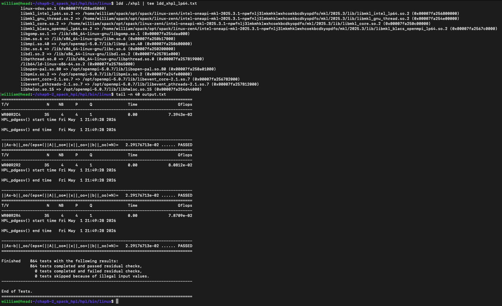

# High-Performance Computing: Profiling, Parallelism, and Benchmarking

A curated portfolio of systems-performance work covering memory locality, SIMD, OpenMP, MPI, GPU acceleration, benchmark interpretation, scientific-software builds, and inference benchmarking.

The work was produced in the context of **HPC-I 2026**. It is reorganized here by engineering theme rather than by homework number.

> This repository is documentation-first. Original code and reports were not rewritten, corrected, reformatted, or modernized.

## Technical coverage

| Area | Project | What it demonstrates | Recorded evidence |
|---|---|---|---|
| CPU memory behavior | [Matrix-sum locality](cpu-memory/01-matrix-sum-locality/) | row-major traversal and cache misses | 2.26× runtime improvement; L1 miss rate 8.47% → 1.54% |
| CPU memory behavior | [Cache-aware transpose](cpu-memory/02-cache-aware-transpose/) | tiled transpose and tile-size exploration | naive versus six tile sizes |
| Profiling and OpenMP | [AMD uProf + HPL study](cpu-memory/03-openmp-profiling-and-hpl/) | hotspots, cache analysis, thread scaling, HPL block-size comparison | loop-order runtime 81.173 s → 14.510 s |
| SIMD and cache blocking | [AVX2 blocked matrix multiplication](cpu-memory/04-avx2-blocked-matrix-multiplication/) | AVX2, tiling, aligned allocation, binary validation | 4096² blocked 6040 ms; AVX2-blocked 5632 ms |
| Cluster operations | [Multi-node MPI validation](mpi-distributed/01-cluster-and-mpi-validation/) | host slots, NFS/cluster setup evidence, eight-rank launch | successful ranks across four nodes |
| Distributed algorithms | [MPI bitonic sort](mpi-distributed/02-parallel-bitonic-sort/) | MPI-IO, partner exchange, compare-split | eight tests passed; best 3.05× speedup |
| MPI profiling | [IPM study](mpi-distributed/03-ipm-mpi-profiling/) | MPI routine time distribution | file-I/O routines dominate profile |
| System characterization | [HPC benchmark suite](benchmarks/system-benchmark-suite/) | HPL, HPCG, STREAM, OSU, IOR | compute, memory, network, storage comparison |
| Build systems | [Static/shared library packaging](software-build/01-static-and-shared-library-packaging/) | archives, shared objects, PIC, runtime lookup | separate static and shared executables |
| GPU programming | [Sobel edge detection](accelerators/sobel-edge-detection/) | HIP kernels and OpenMP target offload | multiple preserved implementation stages |
| Scientific software | [LAMMPS build study](software-build/02-lammps-source-build-study/) | CMake, MPI/OpenMP builds, negative performance result | baseline faster than comparison build |
| Package management | [Spack HPL validation](software-build/03-spack-hpl-validation/) | dependency inspection and HPL correctness | 864 residual tests passed |
| AI systems | [MLPerf Llama2 team study](team-projects/mlperf-llama2/) | Slurm, Apptainer, vLLM, LoadGen, performance tuning | 262.591 → 1193.320 tokens/s (4.54×) |

## Selected highlights

### Memory access can dominate identical arithmetic

The matrix-sum and matrix-multiplication studies show two versions performing the same mathematical work but producing very different runtime because of memory traversal. The matrix-sum report records a drop from 152,522,772 to 28,080,906 L1 data-cache load misses after switching to row-wise access. The OpenMP profiling report records a roughly 5.6× runtime improvement from changing matrix-B access from strided `(i,j,k)` traversal to contiguous `(i,k,j)` traversal.

### Optimization includes correctness checks

The AVX2/blocking project includes a generated reference result and a binary floating-point checker. Uploaded terminal evidence records zero differences for blocked and AVX2-blocked output on the tested matrices.

### Scaling is bounded by communication and resources

The MPI bitonic-sort report records a best speedup of 3.05× at 16 ranks and slower execution at 32 ranks under oversubscription. IPM identifies `MPI_Sendrecv` as the dominant MPI cost, connecting the scaling curve to the algorithm's repeated partner exchanges.

### Negative results are retained

The LAMMPS study does not turn an unsuccessful optimization into a claimed speedup. Its OpenMP/compiler-flag build ran slower than the baseline, and the report states that more controlled ablations would be required to isolate the cause.

### Benchmark validity before benchmark speed

The MLPerf team study documents storage exhaustion, container-path shadowing, and configuration verification before tuning throughput. After establishing a valid baseline, the recorded best valid result increased from 262.591 to 1193.320 tokens/s.

## HPL validation evidence

The screenshot is an unchanged uploaded artifact. It is included as correctness evidence rather than as a competitive performance result.

## Repository boundaries

- [`docs/COURSE_CONTEXT.md`](docs/COURSE_CONTEXT.md) records the supplied course context.

## Privacy note

Several original reports contain a student number and name because removing them would alter the source documents. Review those files before publishing the repository publicly.
